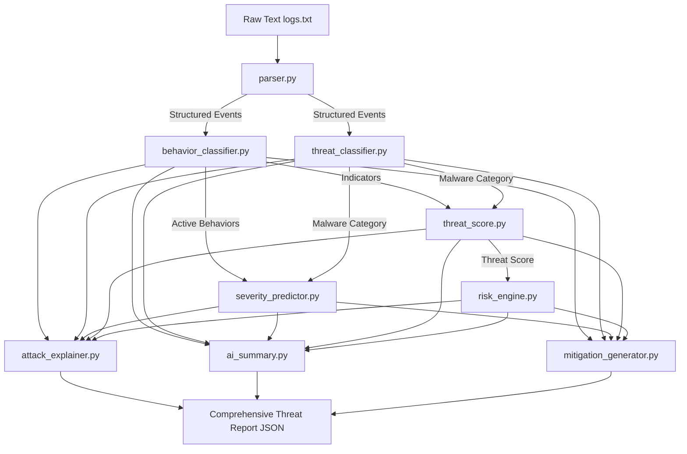

# 🧠 DroidWatch AI — Threat Intelligence Engine

The **AI Threat Intelligence Engine** is a modular Python package located in `ai_engine/`. It consumes raw sandboxed Android execution logs (ADB logcat, Wireshark, etc.) and reconstructs the threat profile of the application using a combination of **Machine Learning classifiers** and **expert heuristics**.

---

## 🏛️ Architecture



---

## 📦 Package Structure

```txt
ai_engine/
│
├── parser.py                # Regex parser converting log lines to structured events
├── __init__.py              # Central orchestrator exposing analyze_events/analyze_log_file
│
├── models/                  # AI / Machine Learning Classification Models
│   ├── __init__.py
│   ├── threat_classifier.py # RandomForest model predicting Malware Category
│   ├── behavior_classifier.py# Regex-heuristic parser classifying actions
│   └── severity_predictor.py# DecisionTree model predicting threat severity
│
├── scoring/                 # Mathematical Risk & Score Calculators
│   ├── __init__.py
│   ├── threat_score.py      # Category-weighted layer threat score (0-100)
│   └── risk_engine.py       # Combines threat score and device vulnerability
│
└── summarizer/              # Incident Response & Explainers
    ├── __init__.py
    ├── ai_summary.py        # Executive descriptive summaries (simulated LLM)
    ├── attack_explainer.py  # MITRE ATT&CK chronological mapping
    └── mitigation_generator.py # Context-aware layer active recommendations
```

---

## ⚙️ Module Breakdown

### 1. Log Event Parsing (`parser.py`)
Parses execution trace strings into structured events. It extracts IP addresses, DNS queries, file paths, and requested permissions:
```python
{
  "timestamp": "2026-05-30T23:05:00",
  "layer": "network",       # network, filesystem, or system
  "level": "WARNING",       # INFO, WARNING, ERROR, CRITICAL
  "message": "DNS request for malware-c2-channel.com",
  "indicators": {
    "dns_query": "malware-c2-channel.com"
  }
}
```

### 2. Category Classifier (`models/threat_classifier.py`)
Extracts a **14-dimensional feature vector** from event counts and permission indicators, and runs them through a `scikit-learn` `RandomForestClassifier` trained on dynamic malware profiles.
* **Outputs**: `Benign`, `Spyware`, `Trojan`, `Adware`, `Ransomware`, or `Worm`, alongside probability distribution and confidence score.
* **Safety Override**: If the ML model classifies a short trace as "Benign" but critical indicators are present, it falls back to expert heuristics.

### 3. Behavior Classifier (`models/behavior_classifier.py`)
Computes confidence levels and matches logs as evidence for:
- `C2_COMMUNICATION`
- `SMS_INTERCEPTION`
- `ACCESSIBILITY_ABUSE`
- `PERSISTENCE_ESTABLISHED`
- `PAYLOAD_EXTRACTION`
- `PRIVILEGE_ESCALATION`
- `DATA_EXFILTRATION`

### 4. Severity Predictor (`models/severity_predictor.py`)
Applies a `DecisionTreeClassifier` on the predicted malware category, active behaviors count, and high-risk flags (like root check or accessibility abuse) to determine the threat severity:
* `INFORMATIONAL` | `LOW` | `MEDIUM` | `HIGH` | `CRITICAL`

### 5. Threat Score (`scoring/threat_score.py`)
Calculates threat scores (0-100) for the **Network**, **File System**, and **System** layers using a weighted formula. The overall Threat Score dynamically shifts layer weights depending on the malware category (e.g. Ransomware weights File System at 60%, Spyware weights System/Network higher).

### 6. Risk Engine (`scoring/risk_engine.py`)
Evaluates operational risk by multiplying the Threat Score against context parameters:
$$\text{Risk Score} = \text{Threat Score} \times \text{Asset Criticality Multiplier} \times \text{Vulnerability Multiplier}$$
* **Asset Criticality**: `LOW` (x0.7) | `MEDIUM` (x1.0) | `HIGH` (x1.3) | `CRITICAL` (x1.5)
* **Vulnerability Rating**: `LOW` (x0.8) | `MEDIUM` (x1.0) | `HIGH` (x1.2) | `CRITICAL` (x1.4)

### 7. Attack Explainer (`summarizer/attack_explainer.py`)
Matches events chronologically against **MITRE ATT&CK techniques** (e.g., `T1639` for SMS Redirection, `T1071` for Web protocols, `T1546` for Accessibility abuse) to output a timeline mapping for the dashboard.

### 8. Mitigation Generator (`summarizer/mitigation_generator.py`)
Generates actionable recommendations customized to the specific attack (e.g., dynamically injecting blocked domain names, quarantined files, and IPs directly into the instructions).

---

## 🚀 Running Verification & Tests

### Automated Unit Tests
To run the automated tests validating the scoring, ML prediction, and parsing modules:
```bash
python -m unittest DroidWatchAI/tests/ai_tests/test_ai_engine.py
```

### Manual Validation Script
To run a manual test demonstrating the E2E analysis pipeline on a simulated Spyware attack trace:
```bash
python DroidWatchAI/tests/ai_tests/run_manual_e2e.py
```
*(Note: A copy of this scratch script is stored in the workspace logs directories).*
